# Взлом программы

## Введение
Данный проект является учебным. Работа выполнялаь в операционной системе DOS, поскольку в ней можно работать на очень низком уровне.

Условия задачи:
1. Разбиться на пары
2. Написать crackme с двумя уязвимостями
3. Обменяться файлами
4. Взломать crackme оппонента
5. Написать программу с графическим интерфейсом, которая бы меняла байты в предоставленной программе, таким образом, чтобы программа
выводила сообщение о правильности ввода пароля при неправильном вводе.
## 1. Взлом оппонента

### Исходные данные

Программа представляла собой исполняемый файл с расширением .com, работающий в среде **DOS**. Для анализа использовались следующие инструменты:

**• Дизассемблер(Interactive Disassembler(IDA))**: для анализа машинного кода и получения ассемблерного листинга

**• Отладчик(TurboDebugger)**: для пошагового выполнения программы и анализа состояния регистров и памяти.

### Взлом

Откроем предоставленный файл в дизассемблере и проанализируем его работу.

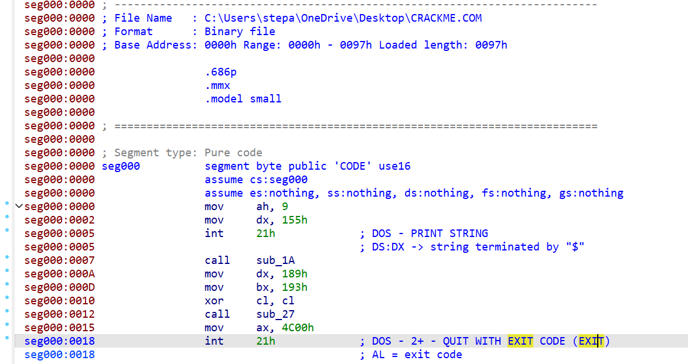

При вызове программы на экран выводится строчка, расположенная по адресу 155h, далее вызываются две функции и затем происходит завершение программы. Посмотрим, какие строки имеются в нашей программе. Для того чтобы их увидеть, были использованы комментарии, которые дизассемблер вставляет
в view-режиме "Disassembly" после строк с объявлением байтов(db).

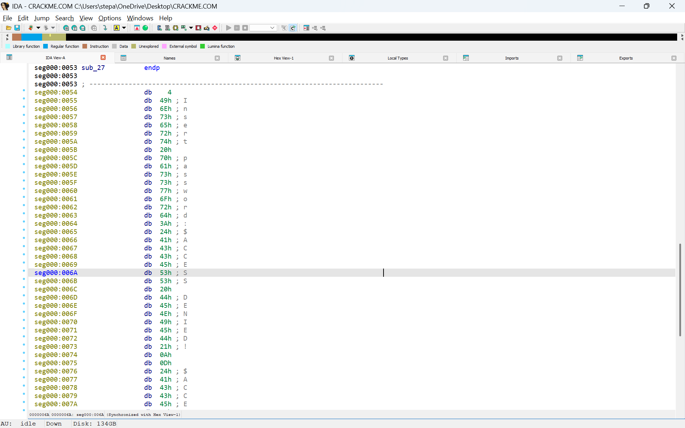

Сообщение "Access granted!" находится по адресу 77h. Так как в DOS адреса смещаются на 100 из-за Programm Segment Prefix(PSP), то, чтобы получить правильный адрес нужно прибавть к обнаруженному адресу 100h. Нужный адрес: 77h + 100h = 177h

Далее, с помощью "Search -> Immediate value" была найдена функция использующая данный адрес.

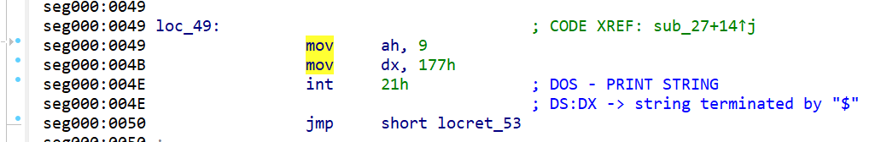

Из комментария оставленного дизассемблером к функции видно, что функция **loc_49** выводит сообщение о том, что введеный пароль верен. Посмотрим какие условия должны выполняться для вызова этой функции.

Произведем анализ тела функции **sub_27**.

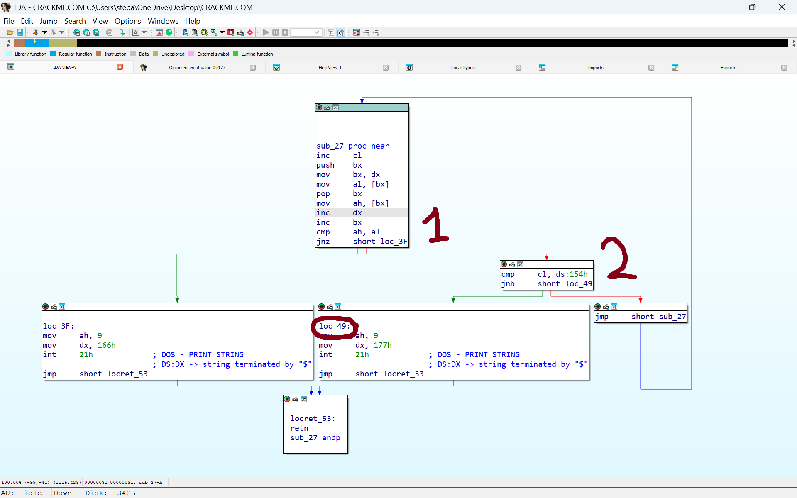

Функция **loc_49** отвечает за вывод сообщения о верном пароле. Чтобы она вызвалась, должны выполниться два условия:
1. Сравнение двух байтов.
2. Проверка счетчика ( при достижении **cl** значения **4** ( которое лежит по адресу **154h**) вызывается **loc_49** ).

**Вывод:**\
• метод определения правильности пароля - **побайтовое сравнение двух строк**.\
• пароль **4-х** значный.

Также при рассмотрении строк была замечена фраза **"INSERT PASSWORD"**, что указывает на ввод с клавиатуры. В начале программы после вывода этой строки, вызывается функция **sub_1A**, которая, по предположению, считывает пароль.

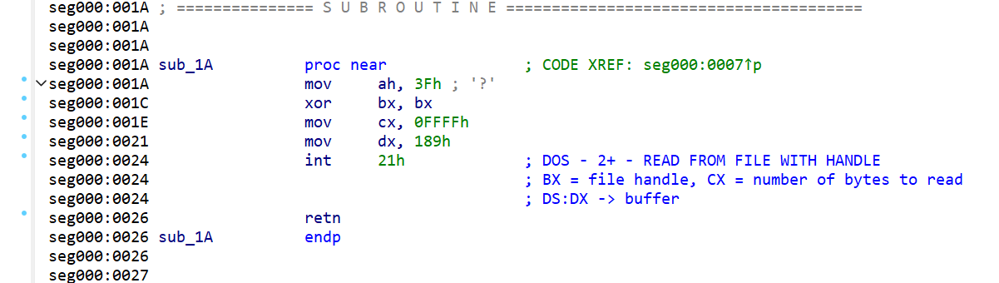

Комментарии дизассемблера раскрывают все карты: перед нами функция считывания пароля, которая может записать FFFF байт, в буфер по адресу 189h с клавиатуры.

Вырезка из DOS TechHelp

File handle, в данном случае, равен 0 ( bx = 0 ), воспользуемся thelp, чтобы узнать откуда именно происходит ввод.
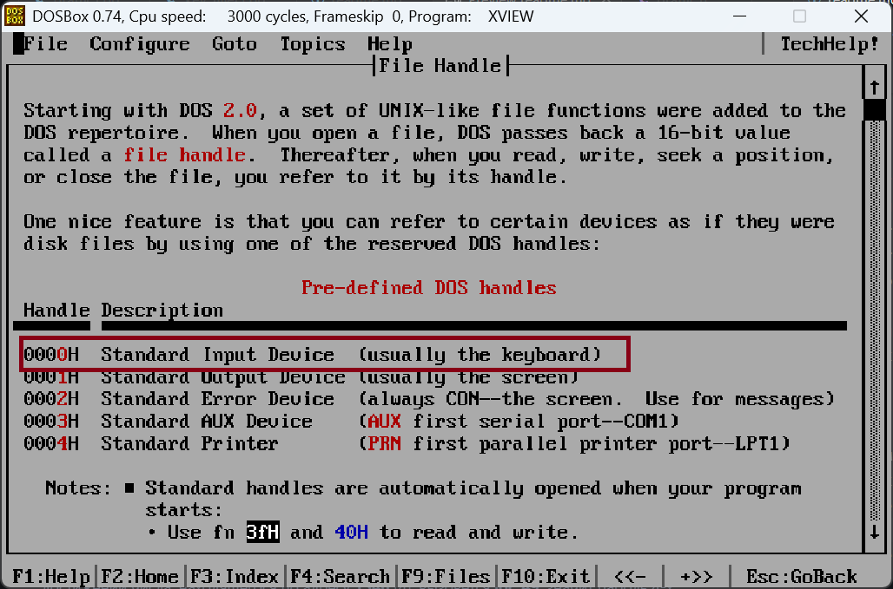

\
Допустимый размер буфера для ввода очень большой, а адрес буфера 189h. То есть переполнением буфера можно затереть практически весь сегмент, за исключением части находящейся перед буфером.

Заметим, что в теле перед вызовом **sub_27**  некоторым регистрам ( **bx**, **cl**, **dx** ) присваиваются какие-то значения. Предположим, что это аргументы функции. Так как в функции идет сравнение строчек по адресам **bx** и **dx**, то по адресу, лежащему в одном из регистров, находится строка с паролем.

Ранее мы узнали, что 189h - адрес буфера записи с клавиатуры, значит 193h - адрес пароля.

Открылась легкая уязвимость: так как пароль находится в памяти после буфера ввода, то с помощью переполнения буфера можно перезаписать пароль.

Пример взлома через легкую уязвимость

()
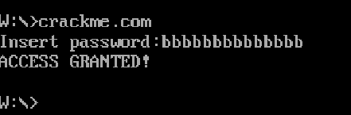

\
Итак, легкая уязвимость найдена! Но на самом деле мы уже нашли вторую уязвимость: из-за того, что позволяется записать в буфер количество байт размером с сегмент, если переполнить буфер и дойти до стека программы, который находится в конце сегмента. Переполнив буфер настолько, что можно положить в стек адрес возврата на функцию **loc_49**, мы заставляем программу использовать сторонний код, который мы сами и написали.

С помощью **TurboDebugger** был проанализирован стек перед **ret** в функции ввода пароля:

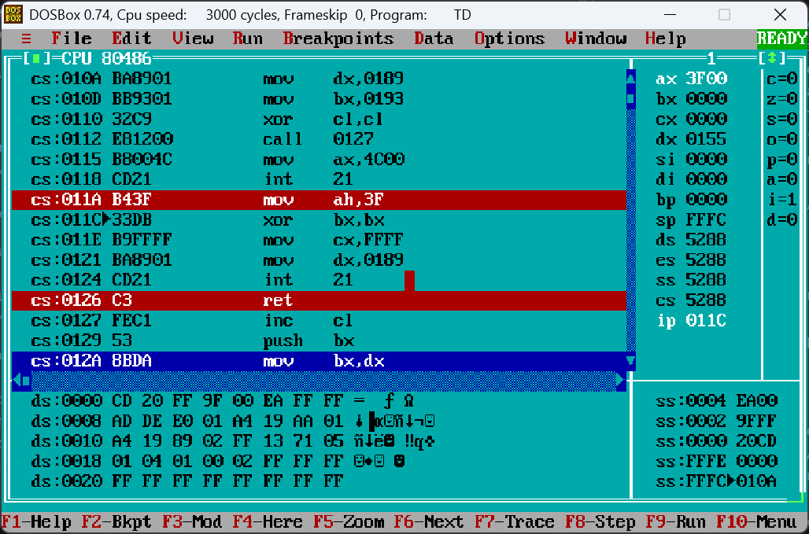

<pre>sp = FFFC</pre>
Значит адрес для перезаписи: **FFFF - 0189h - 2**, вычитание двух байт нужно для того, чтобы не затереть байты с **FFFE** по **FFFH** .

Пример взлома через сложную уязвимость.

\
Альтернативный метод - бинарный патчинг

Программа-крякер изменяет исходный код так, чтобы crackme всегда выводила сообщение о верном пароле. Программа представляет из себя графическое приложение. При запуске появляется симуляция, после завершения которой входной файл модифицируется.

Поменяем адрес возврата в функции сравнения паролей, чтобы всегда выводилась строка "ACCESS GRANTED", и теперь программа принимает любой пароль.

Пример взлома через бинарный патч

### Графика
Вместо того, чтобы пользователь просто сидел 3 миллисекунды, ему предлагается пронаблюдать за симуляцией. Доступен выбор 2-х персонажей из четырех, между которыми происходит битва. На поле сражения случайно генерируется зеленый квадрат - меч, которым можно наносить урон сопернику. Пока персонаж держит меч, проигрывается мелодия символизирующая данного персонажа. Симуляция заканчивается тогда, когда у одного из бойцов не остается ни одного здоровья ( начальное здоровье 3 ).

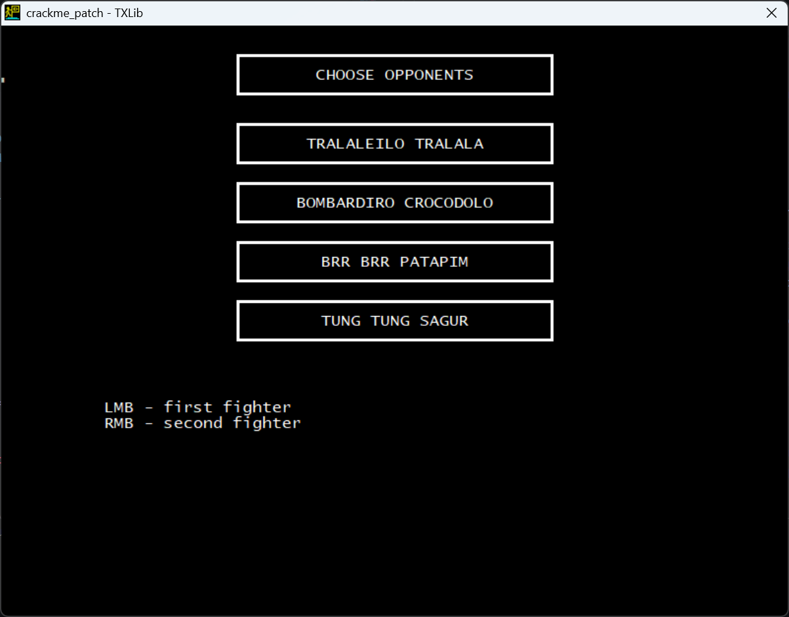 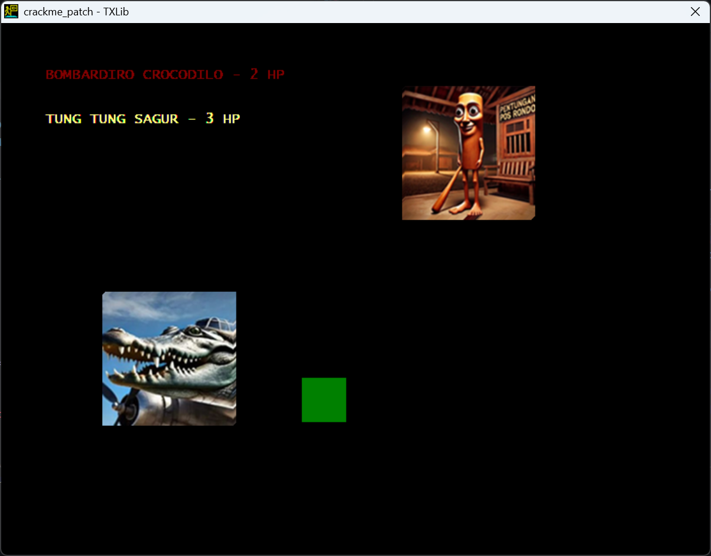
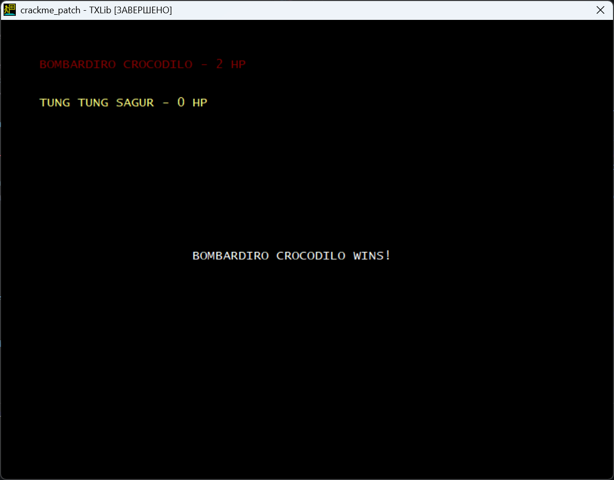
## 3. Итог
В результате анализа программы были найдены и успешно эксплуатированы две уязвимости связанные с переполнением входного буфера. Данная работа - отличный пример того, что всегда важно проверять входные данные, дабы избежать подобных атак.
