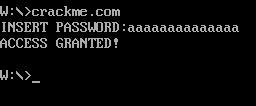
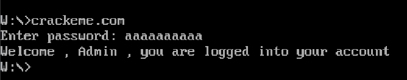
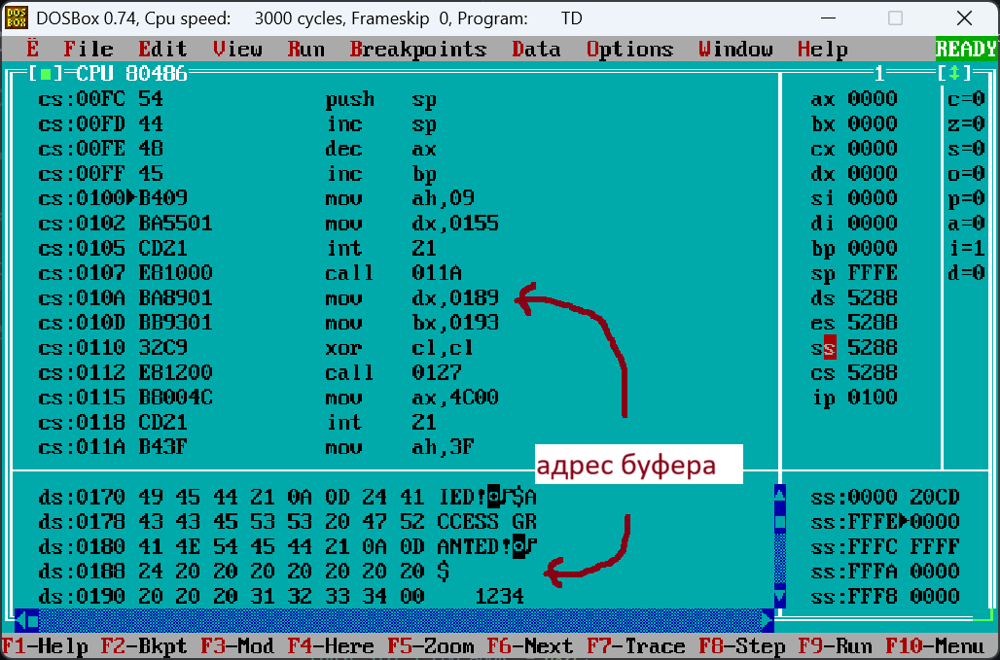
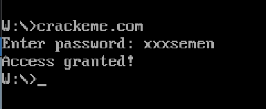

# Взлом программы

## 1.Задача

Задача выполнялась в парах, каждый писал программы на ассемблере, уязвимую для взлома, и осуществляющую взлом

###  • Программа для взлома

Ассемблерная прога запрашивает пароль, проверяет пароль на длину и соответствие с заданным, в противном случае завершается, имеет две уязвимости для взлома

###  • Бинарный патчер

Программа открывает бинраник и меняет определенные биты так чтобы любой пароль подходил. Пока идет взлом дает возможность пользователю пронаблюдать симуляцию.

## 2.Уязвимости

### • Легкая уязвимость
Буфер ввода расположен перед заданным паролем, но максимальная длинна буфера заданна ошибочно, больше нужного, то есть сам буфер залезает на пароль.

```c
USERS_INPUT     db 15                   ;max buffer length
                db 0                    ;actual buffer length
                db 10 dup (" ")
PASSWORD        db 'elda'
```
Это позволяет взломать программу ничего не изменяя: достаточно заполнить буфер одинаковыми символами ( функция сравнения паролей будет проверять одинаковые символы )



### • Сложная уязвимость
Буфер в моей программе при вводе имеет неограниченную длинну, это позволяет при вводе с клавиатуры переполнить буфер, дойти до стека, и вставить в него адрес return на благополучный исход


## 3. Взлом оппонента

Дизассемблируя код турбодебагером была замечена первая уязвимость: буфер ввода находится прямо внутри кода, перед ним стоит обходящий его джамп. То есть можно переполнить буфер, заменив следующую за вызовом прерывания команду на джамп на часть кода, отвечающую за правильный пароль.



<details> <summary>Вторая, более сложная уязвимость оппонента заключается в следующем: при вводе и считывании пароля нигде не ограничевается количество введенных символов</summary>

функция DOS 3f принимает на вход дескриптор файла(bx), количество байтов для возможного ввода(cx) и адрес буфера(dx). Сделав cx = 0xFFFF мы, по факту, сделали количество введенных байтов размером с сегмент

```c
request_pwd proc

            mov     ah, 3fh
            xor     bx, bx
            mov     cx, 0FFFFh
            mov     dx, offset buffer
            int     21h

            ret
            endp
```

</details>

\
Это дает нам возможность переполнить код, и записать в стек адрес команды, дающей нам доступ. Для этого мы пишем программу которая сначла заполнит основной код FFFF - 0189h байт(FFFF - количество байт в сегменте, 189 - адрес буфера ),

 и затем пишем адрес возврата, тк сразу после считывания вызывается **ret**, то он прыгнет по нужному адресу и даст доступ.


Также есть еще возможность для взлома программы пользуясь специальной программой - кряк. Данная программа изменяет исходный код таким образом, чтобы программа для взлома исполняла тот код, который нам требуется. Программа представляет из себя графическое приложение. При запуске появляется симуляция, после завершения которой входной файл крякается.

Изменив байт с 1 на 0, у нас получается отрицание сравнения, т е при вводе любого пароля программа даст доступ

```c
const size_t CMD_ADDR  = 0x2E;
const char NEW_COMMAND = 0x00;

int byte_changer ( FILE* ptr_file )
{
    fseek( ptr_file, CMD_ADDR, SEEK_SET );
    fwrite( &NEW_COMMAND, 1, 1, ptr_file );

    return 0;
}
```
Например:




## ИТОГ
В результате анализа программы были найдены и успешно эксплуатированы две уязвимости связанные с переполнением входного буфера. Данная работа - отличный пример того, что всегда важно проверять входные данные, дабы избежать подобных атак.
